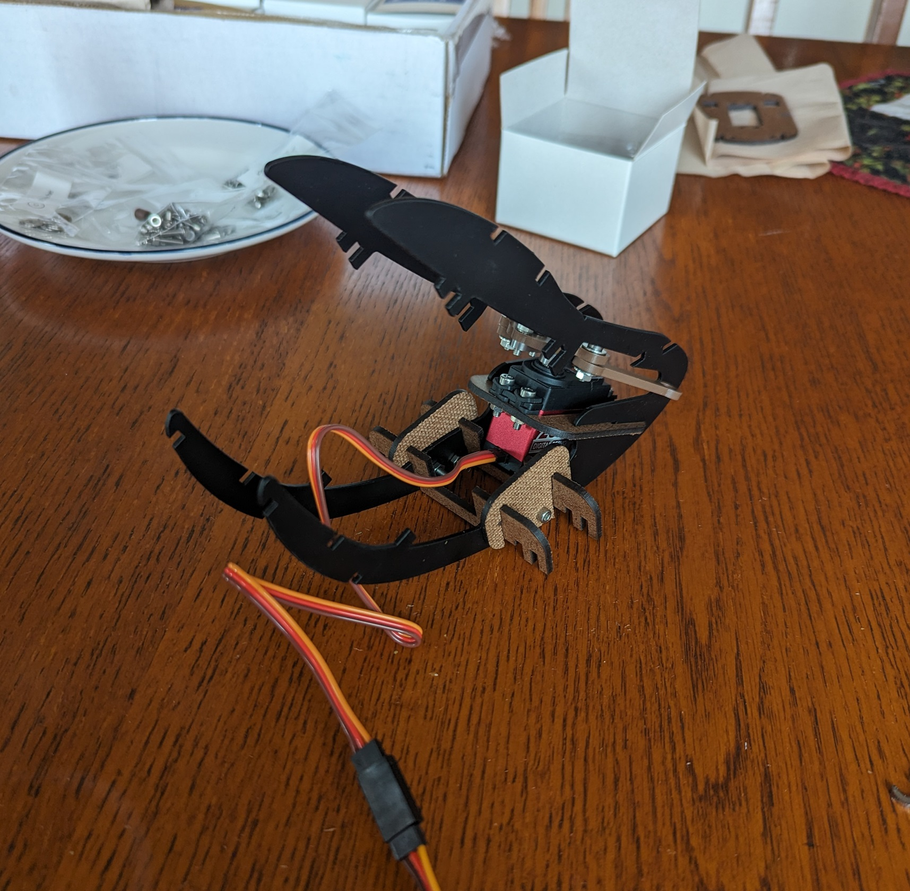
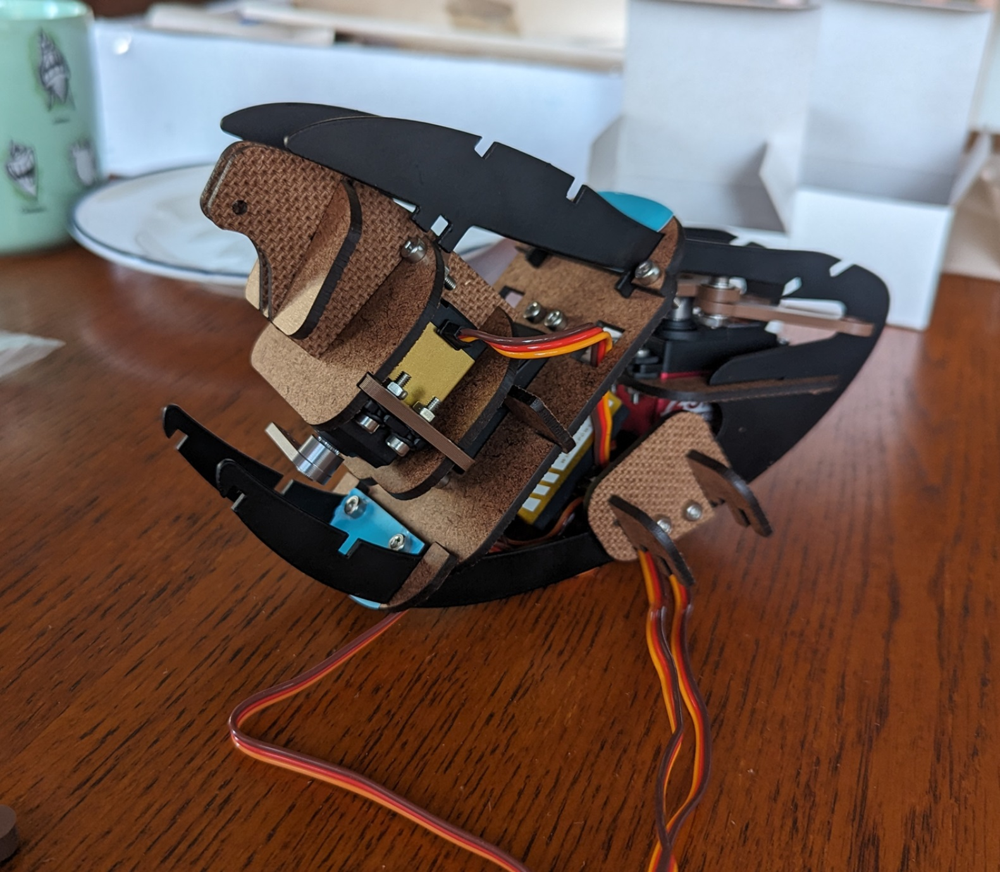

# Botango - Maxwell

This animatronic kit provided by Botango was a learning experience in constructing and animating animatronics. Through constructing this kit, I learned techniques for building with 3D printed and die-cut components as well as wiring different servo motors. This kit was the perfect introduction into animatronics and the included Botango animation software made bringing Maxwell to life intuitive and fun. This project has sparked inspiration to construct even more small animatronics to better learn the craft and serve as a fun creative outlet.

 
 
 
 
